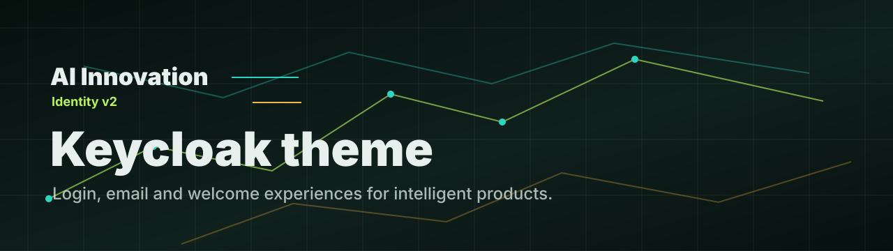
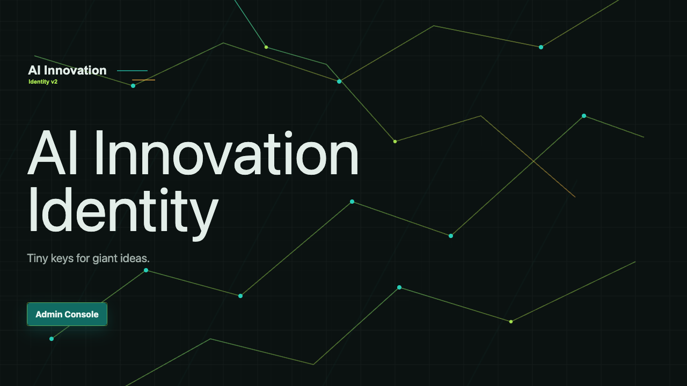
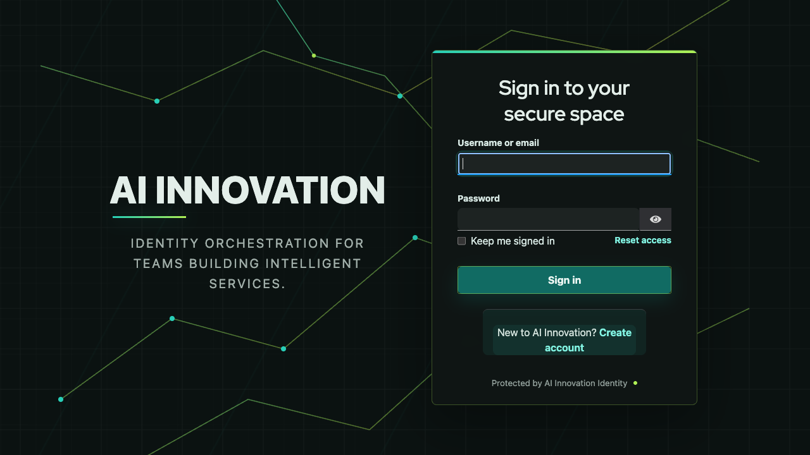
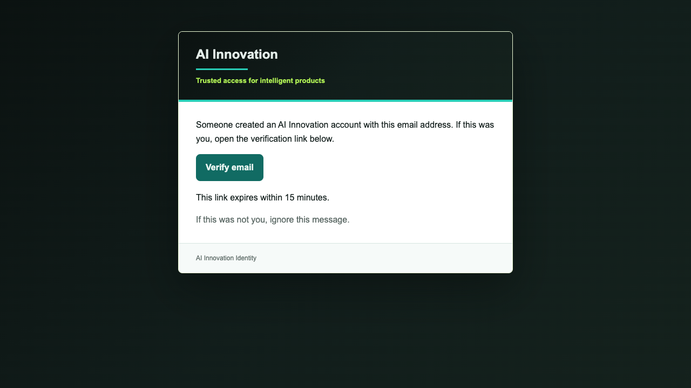

# AI Innovation Keycloak Theme



Ready-to-use Keycloak theme for three supported surfaces:

- `login`: sign-in, registration, password reset, OTP/WebAuthn, identity providers, required actions and error pages.
- `email`: branded transactional email messages and HTML wrapper.
- `welcome`: branded Keycloak landing page, including local bootstrap administrator support.

The project is English-only and intentionally does not ship `account` or `admin` themes.

Current default target: **Keycloak 26.6.2**. Release automation builds ready-to-install artifacts for at least the five latest stable Keycloak versions.

## Screenshots

### Welcome



### Login



### Email



## Quick Start

```bash
docker compose up --build
```

Open:

- Welcome theme: [http://localhost:8080](http://localhost:8080)
- Keycloak Admin: [http://localhost:8080/admin](http://localhost:8080/admin)

Development credentials:

```text
admin / admin
demo / demo
```

Imported realm:

```text
ai-innovation
```

## Useful Commands

```bash
make validate
make package
make package-latest
make package-latest-5
make up
make down
make logs
```

`make package` creates:

```text
build/ai-innovation-keycloak-theme.jar
build/ai-innovation-keycloak-theme-<KEYCLOAK_VERSION>.jar
build/build-metadata.properties
build/build-metadata-<KEYCLOAK_VERSION>.properties
```

The stable `ai-innovation-keycloak-theme.jar` is the file you can drop into a Keycloak `providers/` directory.

## Versioned Builds

Resolve the latest stable Keycloak version from GitHub and build the JAR:

```bash
KEYCLOAK_VERSION="$(./scripts/resolve-keycloak-version.sh)" ./scripts/package-theme.sh
```

Build artifacts for the five latest stable Keycloak versions:

```bash
make package-latest-5
```

Resolve those versions without building:

```bash
./scripts/resolve-keycloak-versions.sh latest-5
./scripts/resolve-keycloak-versions.sh latest-5 --json
```

## GitHub Actions

This project uses two separate workflows:

- [validate.yml](.github/workflows/validate.yml): runs on every push, pull request and manual dispatch. It validates the theme, builds the JAR, and builds a Docker image against the resolved Keycloak version.
- [release.yml](.github/workflows/release.yml): runs when a GitHub release is published, or manually against an existing release tag. It builds artifacts for `latest-5` by default and uploads them to the release.

Release assets:

```text
ai-innovation-keycloak-theme-<KEYCLOAK_VERSION>.jar
build-metadata-<KEYCLOAK_VERSION>.properties
SHA256SUMS
```

Existing release assets are replaced on rerun.

## Project Layout

```text
themes/ai-innovation/
  login/
    error.ftl
    footer.ftl
    messages/
    resources/css/
    resources/img/
    resources/js/
  email/
    html/template.ftl
    messages/
  welcome/
    index.ftl
    messages/
    resources/
```

## Documentation

- [Installation](docs/installation.md)
- [Configuration](docs/configuration.md)
- [Architecture](docs/architecture.md)
- [Customization](docs/customization.md)
- [Workflows and releases](docs/workflows.md)

Dependency updates are handled by [Dependabot](.github/dependabot.yml) for GitHub Actions and Docker references.

## Keycloak Notes

The welcome theme is configured at server startup with:

```text
--spi-theme--welcome-theme=ai-innovation
```

The login and email themes are configured at realm level. The `theme-init` Compose service applies the theme to both the `master` realm and the `ai-innovation` realm so the Admin Console login page is branded too.

During development, Docker Compose disables Keycloak theme caches. Re-enable caching in production.

Official references:

- [Working with themes](https://www.keycloak.org/ui-customization/themes)
- [Customizing the Welcome Theme](https://www.keycloak.org/ui-customization/welcome-theme)
- [Getting started with Docker](https://www.keycloak.org/getting-started/getting-started-docker)
